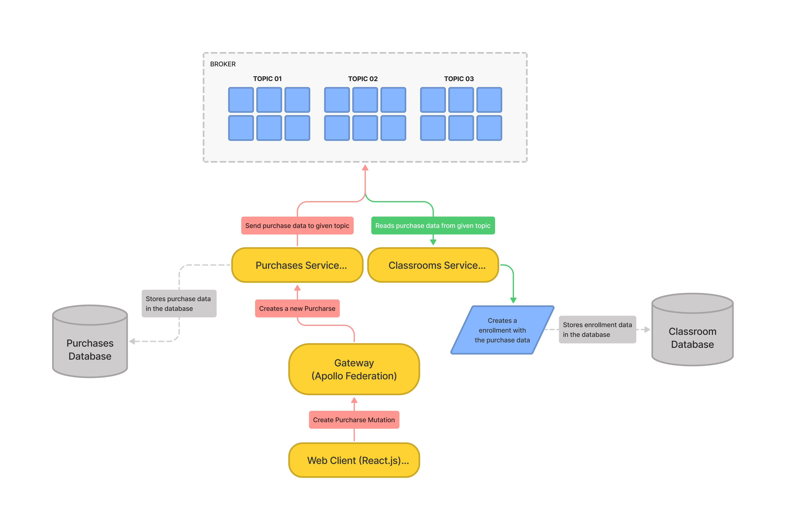

<h1 align="center">
  Ignite Lab
   
  
  
  
  
  
</h1>

## :page_facing_up: Description
Ignite Lab is a course platform that was built using the [microservice architecture](https://en.wikipedia.org/wiki/Microservices).

## 🛠 Tools
Tools that were used to build this project:

- [Typescript](https://www.typescriptlang.org/)
- [Node.js](https://nodejs.org/)
- [Nest.js](https://nestjs.com/)
- [Prisma](https://www.prisma.io/)
- [Apache Kafka](https://kafka.apache.org/intro)
- [React.js](https://reactjs.org/)
- [Next.js](https://nextjs.org/)
- [Apollo Client](https://www.apollographql.com/docs/react/)
- [Codegen](https://www.graphql-code-generator.com/)

## :clipboard: Features
- [x] Sign-In & Sign-Out.
- [x] Create purchase.
- [x] List products.

## :closed_book: Getting started
[TODO]

## :man: Author

<a href="https://github.com/alexandredev3/">
 
  
 <b>Alexandre Costa</b>
</a>

Made with :heart: by Alexandre C.🚀

## :memo: License

Copyright © 2020 [Alexandre Costa](https://github.com/alexandredev3). 
This project is [MIT](./.github/LICENSE.txt) licensed.
